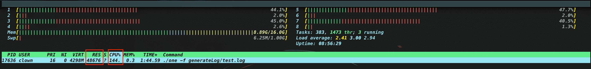
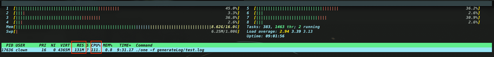
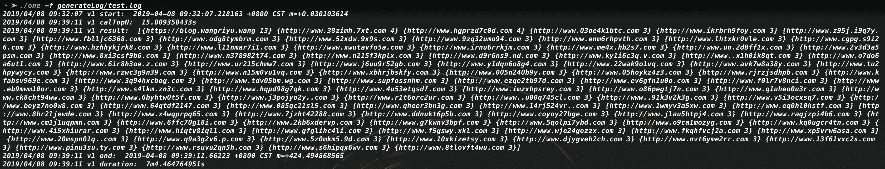
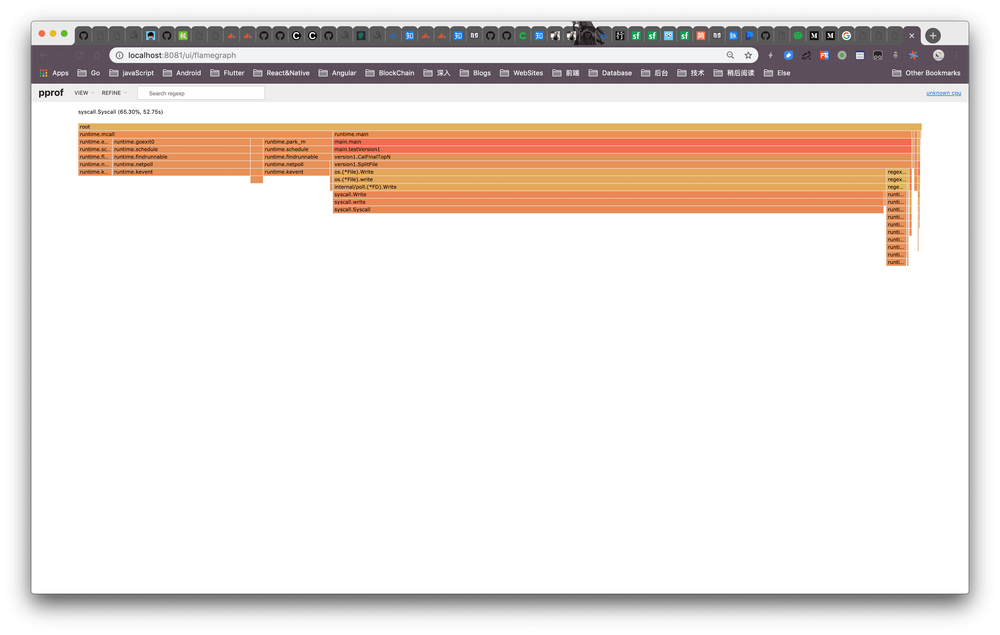
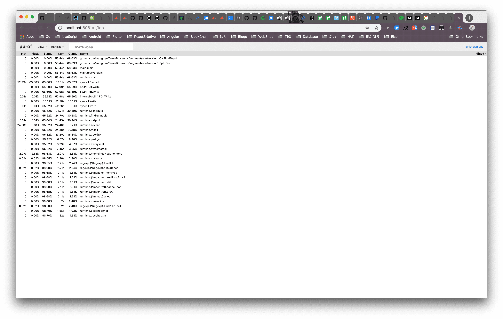
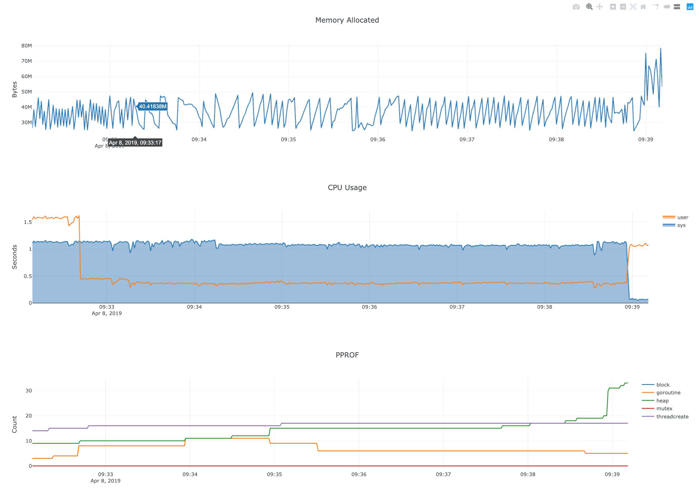
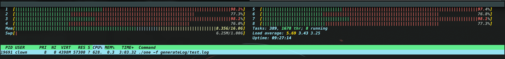
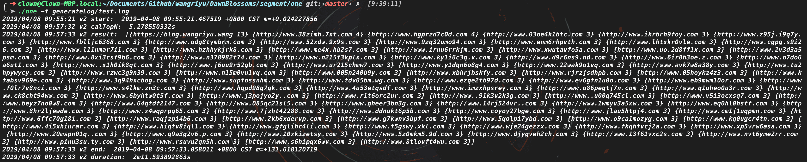
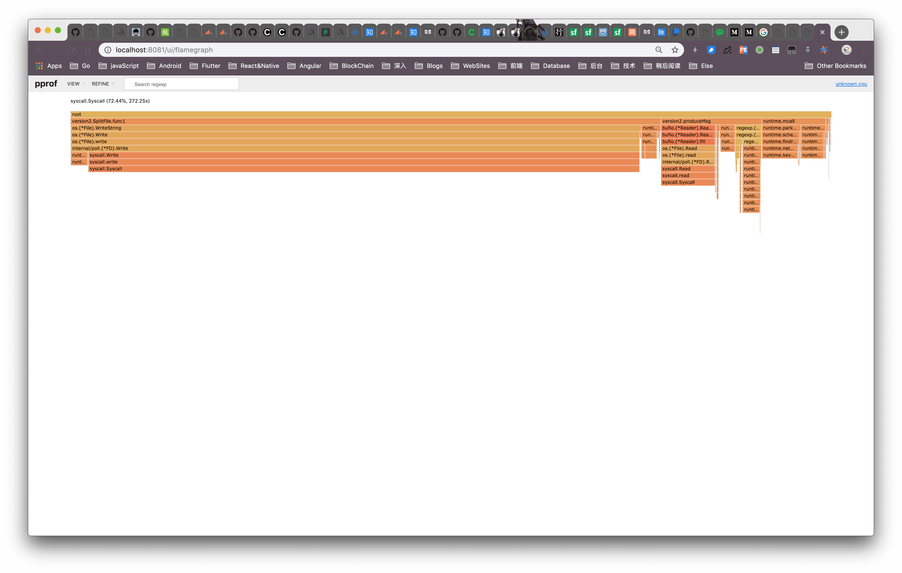
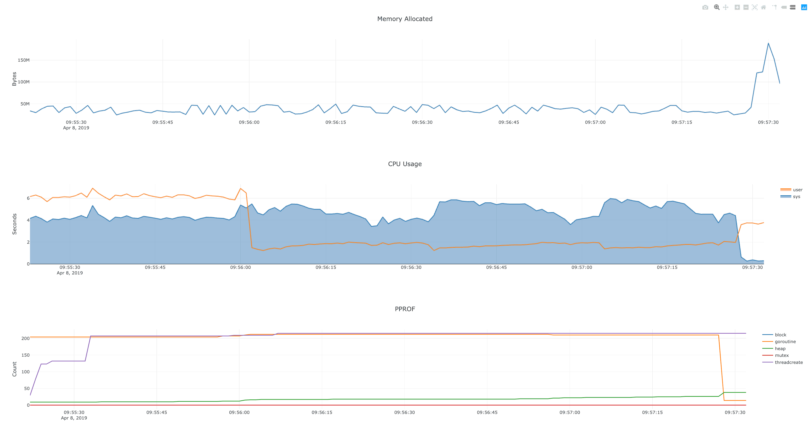

## find Top100 urls in an 100GB file with 1GB memory limited machine

### Test environment

MacBook Pro (Mid 2015), OSX 10.14.1, 2.5 GHz Intel Core i7, 16 GB 1600 MHz DDR3

Go version go1.11.4 darwin/amd64

### Test sample

```dash
$  du -sh generateLog/test.log
  992M    generateLog/test.log
$ wc -l generateLog/test.log
  40000000 generateLog/test.log
```

### Test duration

### version1

- rehash file: 7min



- calTopN: 15s



- result



- pprof

rehash profile(60s):





memory:



### version2

- rehash file: 2min



- calTopN: 5s

- result



- pprof

rehash profile(60s):



memory:



### 改动

在 v1 的基础上，改进了一部分代码逻辑，比如固定长的最小堆，当元素满的时候，如果添加新元素，原先的逻辑是先 pop 再 push，这里面涉及到两次调整，v2 改为直接找新元素的插入位置，只调整一次。

还有原先堆排序时将 pop 出的元素放在另一个 list 中，v2 改为将 pop 的元素放到 heap.tree 的末尾，这样 pop 完时原序列变成降序数组，不用额外一份空间。

然后根据 v1 的分析结果，优化了 rehash 和 capTopN 的过程，并行处理。

原先 v1 耗时主要在 rehash 上，而且都耗在系统调用上，下面这段函数每次 ReadLine 后需要 Write file，这里阻塞会影响性能，v2 把写逻辑放到另外的协程处理，通过缓冲 channel 和一个文件一个写协程加速整个 rehash 过程，原本还想把源文件的读取也并行化，暂时还没添加这部分逻辑。

```go
// v1 SplitFile rehash
buf := bufio.NewReader(file)
for {
    line, _, err := buf.ReadLine()
    if err != nil {
        if err == io.EOF {
            return nil
        }
        return err
    }
    if matchedAlice := regForURL.FindAll(line, -1); len(matchedAlice) > 0 {
        for _, v := range matchedAlice {
            key := Hash(v) % SplitFileNum
            if _, err := SplitFiles[key].File.Write(append(v, '\n')); err != nil {
                log.Println(err)
            }
        }
    }
}
```

rehash 完成后 v1 的 CalTopNPerFile 逻辑是逐一处理，v2 改为并行处理，但是因为并行，每个协程栈内存是之前的几倍，所以 v2 需要扩大 SplitFileNum，以减少每个文件处理需要的内存

本次优化主要针对时间上的优化，内存的优化还待测试，因为测试数据比较平均，导致每个 url 重复概率比较小，每个文件对应的计数哈希表内存占用比较大

如果考虑实际情况，url 重复概率比较大，相应的哈希表条目就比较少

如果考虑最坏情况，每个 url 只出现一次，那哈希表的内存需求可能比文件本身还大，这种情况可能需要切分的更细
