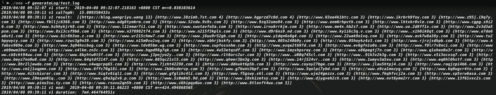
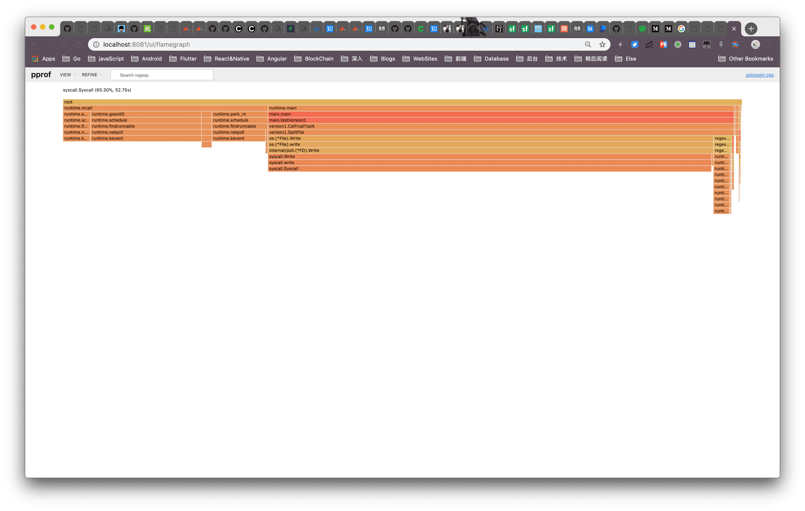

### version1

- Environment

MacBook Pro (Mid 2015), OSX 10.14.1, 2.5 GHz Intel Core i7, 16 GB 1600 MHz DDR3

- Sample

```dash
$ du -sh generateLog/test.log
  5.9G	generateLog/test.log
$ wc -l generateLog/test.log
  243706857 generateLog/test.log
```

- duration

rehash file: 30 min


calTopN: 2min


- result



- pprof

heap(coutTable):


rehash profile(file write):



